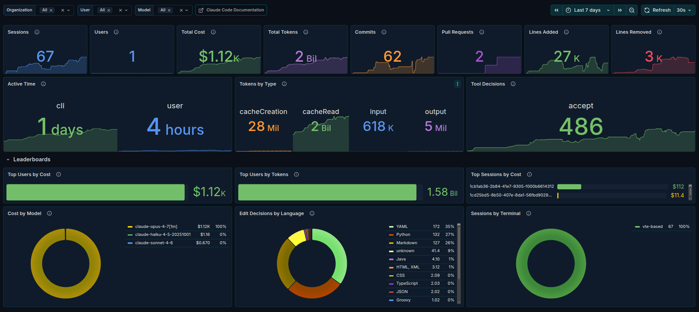
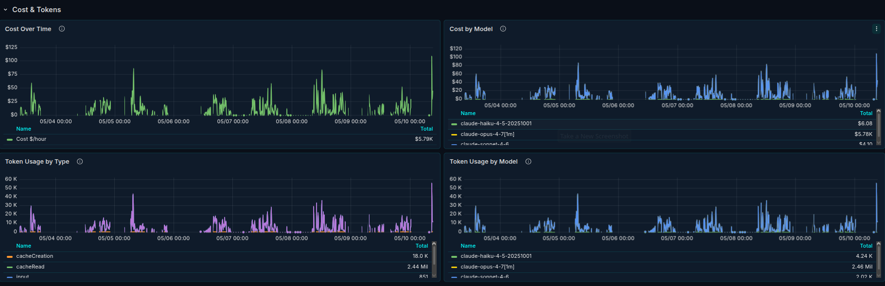
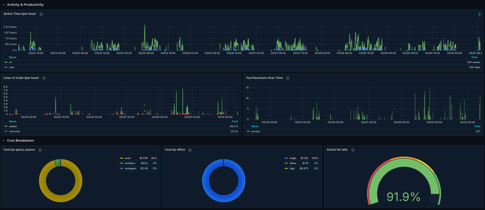

# Claude Code Metrics (Prometheus)

A Grafana dashboard for monitoring [Claude Code](https://www.claude.com/product/claude-code) CLI usage on Prometheus-compatible backends. Consumes Claude Code's OpenTelemetry metrics (emitted via OTLP) and queries them with PromQL. Compatible with Prometheus, VictoriaMetrics, Mimir, and Thanos.

> **grafana.com:** *(listing link to be added on first publish)*
> **Inspired by** [dashboard 25052 by 1w2w3y](https://grafana.com/grafana/dashboards/25052-claude-code/), which targets Azure Application Insights via KQL. This is a parallel implementation for the Prometheus stack, with every panel re-queried in PromQL against Anthropic's published OpenTelemetry metric names.

## Screenshots



*Top-of-dashboard KPIs and leaderboards.*



*Cost and token usage trends, broken down by model.*



*Per-hour activity, cost decomposition, and cache hit ratio.*

## What's in it

**Overview**: KPIs for sessions, users, total cost, total tokens, commits, pull requests, lines added/removed, active time, tokens by type, and tool decisions.

**Leaderboards**: top users by cost and tokens, top sessions by cost, cost by model, edit decisions by language, and sessions by terminal.

**Cost & Tokens**: cost over time (overall and by model) and token usage over time (by type and by model).

**Activity & Productivity**: active time per hour, lines of code per hour, and tool decisions over time.

**Cost Breakdown**: cost by query source, cost by effort, and cache hit ratio.

The dashboard uses three header variables for filtering: `organization`, `user`, and `model`. Default time range is the last 7 days.

## Requirements

- Grafana 11+
- A Prometheus-compatible data source: Prometheus, VictoriaMetrics, Mimir, or Thanos
- Claude Code with OpenTelemetry telemetry enabled, with metrics routed into your Prometheus-compatible backend

## Setup

This dashboard expects the standard "OTel Collector in the middle" pipeline:

```
Claude Code  →  OTLP  →  OTel Collector  →  /metrics  →  Prometheus  →  dashboard
```

If you already run an OTel Collector and Prometheus, you mostly need to (1) tell Claude Code where to send OTLP, (2) add a Prometheus exporter to your Collector, and (3) add a scrape job to Prometheus.

### 1. Configure Claude Code to emit telemetry

Set these in your shell environment (or in `~/.claude/settings.json` under `env`):

```bash
# Enable telemetry
export CLAUDE_CODE_ENABLE_TELEMETRY=1

# Where to send OTLP. Use the HTTP receiver port (4318) for easier
# debugging; gRPC (4317) works equally well.
export OTEL_EXPORTER_OTLP_ENDPOINT="http://your-collector:4318"

# Recommended: pin temporality to cumulative. Prometheus-family backends
# require cumulative counters. The OpenTelemetry SDK currently defaults to
# cumulative, but defaults can drift between SDK versions, so set it
# explicitly to avoid silent breakage on upgrades.
export OTEL_EXPORTER_OTLP_METRICS_TEMPORALITY_PREFERENCE=cumulative
```

For full details on Claude Code's telemetry options, see [Anthropic's monitoring documentation](https://docs.claude.com/en/docs/claude-code/monitoring-usage).

### 2. Configure the OTel Collector

A minimal Collector configuration that accepts OTLP from Claude Code and exposes a Prometheus `/metrics` endpoint is provided in [`examples/otel-collector-config.yaml`](examples/otel-collector-config.yaml).

If you already run a Collector with other pipelines (traces, logs), add the `otlp` receiver and `prometheus` exporter to it; you don't need a separate Collector.

### 3. Configure Prometheus to scrape the Collector

Add a scrape job pointing at the Collector's Prometheus exporter port (default `:9464`). Example in [`examples/prometheus-scrape.yaml`](examples/prometheus-scrape.yaml).

VictoriaMetrics, Grafana Mimir, and Thanos all accept the same scrape job configuration in their scraper components (`vmagent`, distributor with `--web.enable-otlp-receiver`, etc.).

### 4. Import the dashboard into Grafana

Two options:

**Via grafana.com ID** *(once the dashboard is listed there)*:
In Grafana, go to *Dashboards → New → Import* and paste the dashboard ID.

**Via JSON file**:
Download [`dashboard.json`](dashboard.json) from this repo. In Grafana, go to *Dashboards → New → Import → Upload JSON file* and select it. When prompted, choose your Prometheus-compatible data source.

## Metrics consumed

The dashboard queries the following metric names emitted by Claude Code:

- `claude_code_session_count_total`
- `claude_code_token_usage_tokens_total`
- `claude_code_cost_usage_USD_total`
- `claude_code_active_time_seconds_total`
- `claude_code_lines_of_code_count_total`
- `claude_code_commit_count_total`
- `claude_code_pull_request_count_total`
- `claude_code_code_edit_tool_decision_total`

Filter labels used: `organization_id`, `user_email`, `model`, `session_id`, `terminal_type`, `type` (token type), `language` (file language), `decision`, `query_source`, `effort`.

## Troubleshooting

**No data anywhere.** Verify the full pipeline by checking each hop:

1. Is Claude Code emitting? Run any Claude Code command, then `curl http://your-collector:9464/metrics | grep claude_code_`. You should see Claude Code's metric series listed.
2. Is Prometheus scraping? In Prometheus, go to *Status → Targets* and confirm the `claude-code-metrics` (or whatever you named it) job is `UP`.
3. Are queries finding data? In Grafana *Explore*, select your Prometheus data source and query `claude_code_session_count_total`. Values should appear.

**Some panels show data but `Sessions by Terminal` (or other panels using `count` aggregations) is empty.** Check that your Collector's `prometheus` exporter has `resource_to_telemetry_conversion: enabled: true` set (see the example config). Without it, some attribute-derived labels may not be exposed.

**Counters look wrong (negative rates, jumps to zero).** Likely a temporality mismatch, with Claude Code emitting delta metrics into a cumulative-expecting backend. Set `OTEL_EXPORTER_OTLP_METRICS_TEMPORALITY_PREFERENCE=cumulative` in Claude Code's environment.

**`Pull Requests = 0` even though I've made PRs.** Claude Code only emits the PR counter when *Claude Code itself* opens the PR (e.g., via the `gh` CLI inside a Claude Code session). PRs you open manually outside Claude Code don't count.

**Cost numbers don't match my Anthropic billing dashboard.** Claude Code's cost metric is computed client-side from token counts and published model prices, so it's an estimate. It will be close to billing but not identical, particularly across pricing changes or for cached tokens that get billed differently than the local estimate assumes.

## Contributing

Issues and pull requests welcome. If you've extended the dashboard with panels that work well, particularly anything that adds custom labels via Collector processors, please open an issue describing the setup. Useful patterns may make their way into the canonical version.

For dashboard JSON edits: please make changes in Grafana's UI, export, and submit the resulting JSON. Hand-editing the JSON file directly tends to introduce subtle structural issues that aren't visible until import.

## Credits

Original dashboard concept and panel set: [grafana.com dashboard 25052](https://grafana.com/grafana/dashboards/25052-claude-code/) by [1w2w3y](https://github.com/1w2w3y), targeting Azure Application Insights.

This Prometheus port: [@rockdarko](https://github.com/rockdarko).

## License

[MIT](LICENSE)
